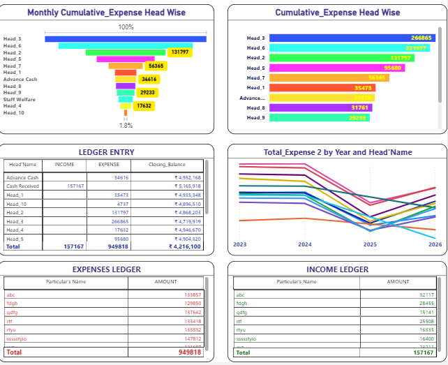

# Daily Cash Flow Tracker — Power BI Dashboard

A Power BI dashboard for tracking and analyzing daily cash inflows and outflows across multiple business locations. Built to monitor opening/closing balances, expense trends, and category-wise spending with dynamic visuals.

> **Note:** This project uses a synthetic/sample dataset (generic category and location placeholders) created for portfolio demonstration purposes. It does not represent real company financial data.

## 📊 Overview

This dashboard helps answer key cash management questions:
- What is the current net available balance?
- How are expenses trending over time?
- Which expense categories and locations are driving spend?
- How does actual spend compare against targets?

## 🛠️ Tools Used

- **Power BI** – Dashboard design & data modeling
- **DAX** – Custom measures for balance calculations, running totals, and dynamic formatting
- **Excel** – Source data structuring (Log Sheet)

## 📁 Files in this Repo

| File | Description |
|---|---|
| `cash_tracker.pbix` | Main Power BI dashboard file (data model, DAX measures, and visuals) |
| `daily_cash_flow_maintenance.xlsx` | Documentation of all DAX measures used, with explanations and usage notes |
| `ecommerce-cash-tracker-dashboard.pdf` | Static PDF export of the full dashboard report |

## 🔑 Key DAX Measures

| Measure | Purpose |
|---|---|
| `Opening_Balance` | Calculates starting balance for any selected date range using cumulative prior transactions |
| `Closing_Balance` | Computes the final net available balance for the selected period |
| `Total_Expense` / `TotalIncome` | Aggregates credits and debits, defaulting cleanly to 0 instead of blank |
| `Cumulative_Expense` | Running total of expenses over time, used for trend visualization |
| `Head Color` / `District Color` | Dynamic, consistent color-coding for categories and locations across all visuals |
| `dynamic_target` / `dynamic_max` | Powers an interactive Gauge chart comparing actual spend vs. target |

## 📈 Dashboard Features

- **KPI Cards** – Opening Balance, Closing Balance, Total Income, Total Expense
- **Geo Map** – Location-wise cash distribution across districts
- **Trend Charts** – Monthly cumulative income & expense trends
- **Category Breakdown** – Expense distribution by head/category with consistent color coding (pie & funnel charts)
- **Gauge Chart** – Actual vs. target spend, with dynamic titles based on selection
- **Ledger Tables** – Detailed income and expense ledgers by head and particular

## 🚀 How to Use

1. Download `cash_tracker.pbix`
2. Open in Power BI Desktop
3. Explore the report pages and interact with slicers/filters
4. Refer to `daily_cash_flow_maintenance.xlsx` for a breakdown of how each measure works
5. Or simply view `ecommerce-cash-tracker-dashboard.pdf` for a quick static preview

## 📌 About This Project

This is part of my ongoing Data Analytics portfolio, where I'm building hands-on Power BI projects to strengthen my DAX, data modeling, and dashboard design skills.

Connect with me on [LinkedIn](https://www.linkedin.com/in/niraj-analytics) for more projects and analytics content.

## 📷 Dashboard Preview

  

  

> 📄 Full report also available as PDF: [ecommerce-cash-tracker-dashboard.pdf](ecommerce-cash-tracker-dashboard.pdf)
